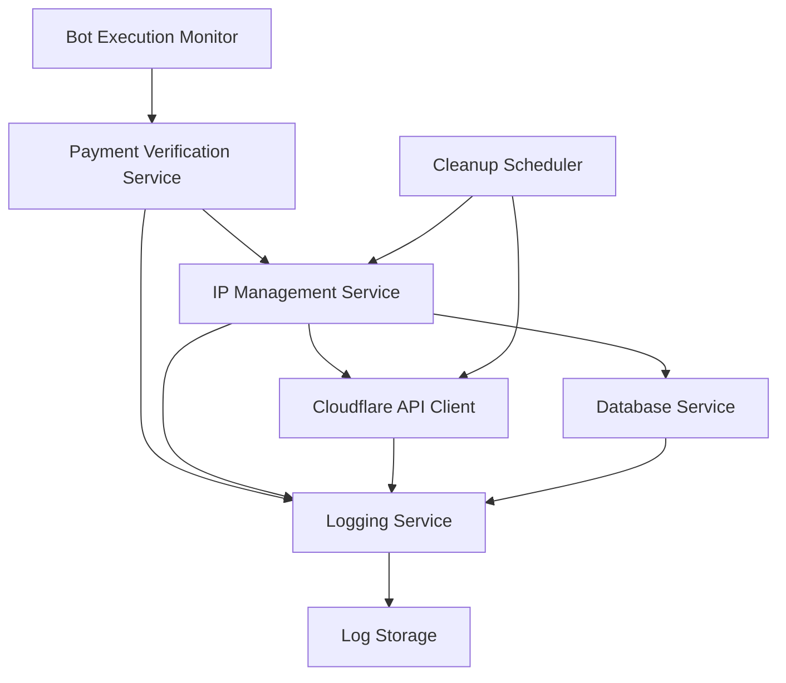

# Automated Bot Payment System Design

## Overview

The Automated Bot Payment System is a service that enables web scrapers and bots to gain temporary access to protected resources through cryptocurrency payments. The system monitors for bot execution, verifies x402 MOVE token payments, manages IP whitelisting through Cloudflare, and automatically cleans up access after a defined period.

## Architecture

The system follows an event-driven architecture with the following key components:



The system operates as a background service that:
1. Monitors for webscraper execution events
2. Verifies incoming x402 payments
3. Manages temporary IP whitelisting
4. Schedules and executes cleanup operations
5. Provides comprehensive logging and monitoring

## Components and Interfaces

### Bot Execution Monitor
- **Purpose**: Detects when the webscraper (`python main.py`) is executed
- **Interface**: File system monitoring or process detection
- **Triggers**: Payment verification workflow when bot execution is detected

### Payment Verification Service
- **Purpose**: Validates x402 MOVE token transactions
- **Interface**: 
  ```typescript
  interface PaymentVerificationService {
    verifyTransaction(transactionId: string): Promise<PaymentResult>
    validateAmount(amount: number): boolean
    extractPayerIP(): Promise<string>
  }
  ```
- **Dependencies**: x402 payment network, IP detection service

### IP Management Service
- **Purpose**: Manages bot IP addresses in database and Cloudflare
- **Interface**:
  ```typescript
  interface IPManagementService {
    addBotIP(ip: string, paymentDetails: PaymentRecord): Promise<void>
    createWhitelistRule(ip: string): Promise<string>
    removeWhitelistRule(ruleId: string): Promise<void>
    scheduleCleanup(ip: string, delay: number): Promise<void>
  }
  ```

### Cloudflare API Client
- **Purpose**: Manages firewall rules through Cloudflare API
- **Interface**:
  ```typescript
  interface CloudflareClient {
    createAccessRule(ip: string, mode: 'whitelist'): Promise<AccessRule>
    deleteAccessRule(ruleId: string): Promise<void>
    listAccessRules(ip?: string): Promise<AccessRule[]>
  }
  ```

### Database Service
- **Purpose**: Manages BotsAllowed table operations
- **Interface**:
  ```typescript
  interface DatabaseService {
    addBotEntry(entry: BotAllowedEntry): Promise<void>
    updateBotEntry(id: string, updates: Partial<BotAllowedEntry>): Promise<void>
    getBotEntry(ip: string): Promise<BotAllowedEntry | null>
  }
  ```

### Cleanup Scheduler
- **Purpose**: Manages timed cleanup operations
- **Interface**:
  ```typescript
  interface CleanupScheduler {
    scheduleCleanup(ip: string, delay: number): Promise<void>
    cancelCleanup(ip: string): Promise<void>
    executeCleanup(ip: string): Promise<void>
  }
  ```

## Data Models

### PaymentRecord
```typescript
interface PaymentRecord {
  transactionId: string
  amount: number
  currency: 'MOVE'
  timestamp: Date
  payerAddress: string
  verified: boolean
}
```

### BotAllowedEntry
```typescript
interface BotAllowedEntry {
  id: string
  ipAddress: string
  reason: string
  paymentRecord: PaymentRecord
  whitelistRuleId?: string
  createdAt: Date
  expiresAt?: Date
  cleanedUp: boolean
}
```

### AccessRule
```typescript
interface AccessRule {
  id: string
  mode: 'whitelist' | 'block'
  configuration: {
    target: 'ip'
    value: string
  }
  notes: string
}
```

## Correctness Properties

*A property is a characteristic or behavior that should hold true across all valid executions of a system-essentially, a formal statement about what the system should do. Properties serve as the bridge between human-readable specifications and machine-verifiable correctness guarantees.*
Property 1: Bot execution detection triggers payment verification
*For any* webscraper bot execution event, the system should initiate the payment verification process
**Validates: Requirements 1.1**

Property 2: Valid payment transactions pass verification
*For any* x402 transaction with exactly 0.01 MOVE tokens, the system should verify the transaction as authentic and valid
**Validates: Requirements 1.2**

Property 3: Successful payment verification extracts IP address
*For any* successful payment verification, the system should automatically extract the requesting IP address
**Validates: Requirements 1.3**

Property 4: IP addresses are stored with payment timestamps
*For any* determined IP address, the system should add it to the BotsAllowed_Database with the correct payment timestamp
**Validates: Requirements 1.4**

Property 5: Database entries trigger whitelist rule creation
*For any* IP address added to the database, the system should create a corresponding Cloudflare whitelist rule
**Validates: Requirements 1.5**

Property 6: Whitelist rules are scheduled for 60-second removal
*For any* created Cloudflare whitelist rule, the system should schedule automatic removal after exactly 60 seconds
**Validates: Requirements 2.1**

Property 7: Scheduled rules are removed at expiration
*For any* scheduled whitelist rule, the system should remove it from Cloudflare when the scheduled time expires
**Validates: Requirements 2.2**

Property 8: Whitelist removal updates database entries
*For any* successful whitelist rule removal, the system should update the corresponding BotsAllowed_Database entry with an expiration timestamp
**Validates: Requirements 2.3**

Property 9: Failed cleanup operations trigger retry with backoff
*For any* failed cleanup operation, the system should log the error and attempt retry with exponential backoff
**Validates: Requirements 2.4**

Property 10: Multiple cleanup failures generate alerts
*For any* cleanup operation that fails multiple times, the system should alert administrators of the failure
**Validates: Requirements 2.5**

Property 11: Payment verification events are logged completely
*For any* payment verification operation, the system should log transaction details, IP address, and timestamp
**Validates: Requirements 3.1**

Property 12: Cloudflare operations are logged with status
*For any* whitelist rule creation or removal, the system should log the Cloudflare API operation with success/failure status
**Validates: Requirements 3.2**

Property 13: Database modifications are logged
*For any* BotsAllowed_Database operation, the system should log all modifications
**Validates: Requirements 3.3**

Property 14: Errors are logged with detailed context
*For any* error during system operations, the system should log detailed error information with context
**Validates: Requirements 3.4**

Property 15: Duplicate payments prevent duplicate whitelist entries
*For any* IP address, receiving duplicate payment transactions should result in only one whitelist entry being created
**Validates: Requirements 4.1**

Property 16: Incorrect payment amounts are rejected with error messages
*For any* payment transaction with incorrect amount, the system should reject the transaction and provide clear error messaging
**Validates: Requirements 4.2**

Property 17: Network issues trigger retry logic
*For any* network connectivity issue, the system should implement retry logic with appropriate timeouts
**Validates: Requirements 4.3**

Property 18: Rate limits trigger backoff strategies
*For any* Cloudflare API rate limit encounter, the system should implement backoff strategies and queue operations
**Validates: Requirements 4.4**

Property 19: Database unavailability triggers caching and replay
*For any* BotsAllowed_Database unavailability, the system should cache operations and replay them when connectivity is restored
**Validates: Requirements 4.5**

Property 20: System startup reads existing configuration
*For any* system startup, the system should read configuration from existing environment variables and configuration files
**Validates: Requirements 5.1**

Property 21: Database integration uses existing schema
*For any* database operation, the system should use the current BotsAllowed table schema without modifications
**Validates: Requirements 5.2**

Property 22: Cloudflare API calls use existing tokens
*For any* Cloudflare API call, the system should use existing API tokens and zone configurations
**Validates: Requirements 5.3**

Property 23: Webscraper execution detection uses existing mechanisms
*For any* webscraper execution, the system should detect it through existing monitoring mechanisms
**Validates: Requirements 5.4**

Property 24: IP detection uses consistent method
*For any* IP address detection need, the system should use the same method as existing scripts (curl icanhazip.com)
**Validates: Requirements 5.5**

## Error Handling

The system implements comprehensive error handling across all components:

### Payment Verification Errors
- Invalid transaction format or signature
- Incorrect payment amounts (not exactly 0.01 MOVE)
- Network timeouts during verification
- Blockchain connectivity issues

### Database Errors
- Connection failures to BotsAllowed_Database
- Constraint violations (duplicate IP entries)
- Transaction rollback scenarios
- Schema compatibility issues

### Cloudflare API Errors
- Authentication failures with API tokens
- Rate limiting and quota exceeded
- Network connectivity to Cloudflare
- Invalid zone or rule configurations

### System Errors
- Configuration file parsing errors
- Environment variable missing or invalid
- Process monitoring failures
- Cleanup scheduling conflicts

## Testing Strategy

The system employs a dual testing approach combining unit tests and property-based tests:

### Unit Testing
- Specific examples of payment verification scenarios
- Edge cases for IP address validation
- Error condition handling for each component
- Integration points between services
- Configuration loading and validation

### Property-Based Testing
- Uses **fast-check** library for TypeScript property-based testing
- Each property-based test runs a minimum of 100 iterations
- Tests verify universal properties across all valid inputs
- Generates random but valid test data for comprehensive coverage

**Property-based test requirements:**
- Each correctness property must be implemented by a single property-based test
- Tests must be tagged with comments referencing the design document property
- Tag format: `**Feature: automated-bot-payment-system, Property {number}: {property_text}**`
- Tests should avoid mocking when possible to validate real functionality
- Smart generators should constrain input space to valid scenarios

### Integration Testing
- End-to-end payment flow validation
- Cloudflare API integration testing
- Database transaction integrity
- Cleanup scheduling and execution
- Error recovery and retry mechanisms

The testing strategy ensures both specific edge cases are covered through unit tests and general correctness is verified through property-based testing across the entire input space.