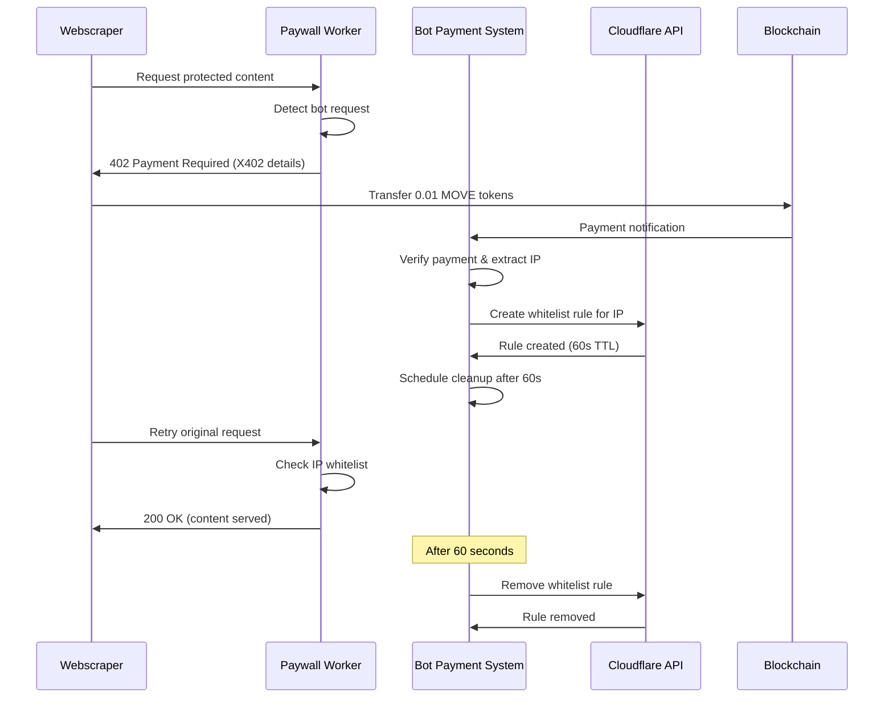

# X402 Payment Integration Fix Design

## Overview

This design document outlines the solution for fixing the X402 payment integration between the webscraper, paywall worker, and automated bot payment system. The current system blocks all bots with 403 errors, but the expected flow should allow payment-based access through X402 MOVE token transactions.

The solution involves:
1. Updating the paywall worker to implement proper X402 payment flow
2. Enhancing the webscraper to handle payment requirements automatically
3. Fixing service initialization to use the new bot payment system
4. Ensuring proper IP address handling throughout the flow

## Architecture

The fixed system will follow this flow:



## Components and Interfaces

### Enhanced Paywall Worker
- **Purpose**: Handle X402 payment flow instead of blocking all bots
- **Changes**: 
  - Replace 403 blocking with 402 Payment Required responses
  - Add X402 payment verification logic
  - Integrate with bot payment system for IP whitelisting
- **Interface**:
  ```javascript
  // X402 Payment Response
  {
    status: 402,
    headers: {
      "WWW-Authenticate": "X402-Payment",
      "X402-Payment-Address": "move_payment_address",
      "X402-Payment-Amount": "0.01",
      "X402-Payment-Currency": "MOVE"
    }
  }
  ```

### Enhanced Webscraper
- **Purpose**: Automatically handle X402 payment flow when blocked
- **Changes**:
  - Detect 402 Payment Required responses
  - Initiate X402 MOVE token payments
  - Wait for whitelisting and retry requests
- **Interface**:
  ```python
  class X402PaymentHandler:
      def handle_payment_required(self, response: Response) -> bool
      def make_move_payment(self, address: str, amount: float) -> str
      def wait_for_whitelist(self, timeout: int = 30) -> bool
  ```

### Service Initialization Fix
- **Purpose**: Properly initialize the bot payment system
- **Changes**:
  - Update ServiceInitializer to use automated bot payment system
  - Remove references to old bot cleanup service
  - Add proper error handling and logging
- **Interface**:
  ```typescript
  interface ServiceInitializer {
    initializeBotPaymentSystem(): Promise<void>
    handleInitializationError(error: Error): void
    gracefulShutdown(): Promise<void>
  }
  ```

### IP Address Management
- **Purpose**: Ensure correct IP address (210.212.2.133) is used for whitelisting
- **Changes**:
  - Configure system to use specified IP address
  - Update IP detection logic in bot payment system
  - Ensure consistency across all components

## Data Models

### X402PaymentRequest
```typescript
interface X402PaymentRequest {
  paymentAddress: string
  amount: number
  currency: 'MOVE'
  clientIP: string
  timestamp: Date
  requestId: string
}
```

### PaymentVerificationResult
```typescript
interface PaymentVerificationResult {
  transactionId: string
  verified: boolean
  amount: number
  payerIP: string
  timestamp: Date
  error?: string
}
```

### WhitelistOperation
```typescript
interface WhitelistOperation {
  ipAddress: string
  ruleId: string
  operation: 'create' | 'remove'
  timestamp: Date
  success: boolean
  error?: string
}
```

## Correctness Properties

*A property is a characteristic or behavior that should hold true across all valid executions of a system-essentially, a formal statement about what the system should do. Properties serve as the bridge between human-readable specifications and machine-verifiable correctness guarantees.*
Property 1: Payment requirement detection triggers X402 flow
*For any* 403 response received by the webscraper, the system should detect the payment requirement and initiate the X402 payment flow
**Validates: Requirements 1.1**

Property 2: X402 payments transfer exact amount
*For any* X402 payment initiation, the webscraper should transfer exactly 0.01 MOVE tokens to the designated payment address
**Validates: Requirements 1.2**

Property 3: Confirmed payments trigger waiting behavior
*For any* confirmed payment transaction, the webscraper should wait for IP whitelisting to complete
**Validates: Requirements 1.3**

Property 4: Active whitelisting enables successful retries
*For any* active IP whitelist, the webscraper should retry the original request and succeed
**Validates: Requirements 1.4**

Property 5: Expired whitelists trigger new payment flows
*For any* whitelist that expires after 60 seconds, subsequent requests should trigger the payment flow again if needed
**Validates: Requirements 1.5**

Property 6: Bot detection returns 402 with X402 details
*For any* detected bot request, the Paywall_Worker should return a 402 Payment Required response with proper X402 payment details
**Validates: Requirements 2.1**

Property 7: X402 payments undergo verification
*For any* received X402 payment, the Paywall_Worker should verify the transaction amount and authenticity
**Validates: Requirements 2.2**

Property 8: Successful verification triggers IP whitelisting
*For any* successful payment verification, the Paywall_Worker should trigger the Bot_Payment_System to whitelist the IP
**Validates: Requirements 2.3**

Property 9: Whitelisted IPs get access
*For any* whitelisted IP address, the Paywall_Worker should allow subsequent requests from that IP to pass through
**Validates: Requirements 2.4**

Property 10: Failed verification returns 403 with errors
*For any* failed payment verification, the Paywall_Worker should return a 403 Forbidden response with error details
**Validates: Requirements 2.5**

Property 11: System startup initializes all services
*For any* Bot_Payment_System startup, the system should initialize all services and begin monitoring for payment events
**Validates: Requirements 3.1**

Property 12: Valid payments enable IP extraction
*For any* valid X402 payment detected, the Bot_Payment_System should extract the payer's IP address automatically
**Validates: Requirements 3.2**

Property 13: IP determination creates 60-second whitelist rules
*For any* determined IP address, the Bot_Payment_System should create a Cloudflare whitelist rule for exactly 60 seconds
**Validates: Requirements 3.3**

Property 14: Rule creation triggers logging and scheduling
*For any* created whitelist rule, the Bot_Payment_System should log the operation and schedule automatic cleanup
**Validates: Requirements 3.4**

Property 15: Expiration triggers rule removal and database updates
*For any* 60-second expiration, the Bot_Payment_System should remove the whitelist rule and update the database
**Validates: Requirements 3.5**

Property 16: Application startup initializes correct service
*For any* main application startup, the system should initialize the Bot_Payment_System instead of the old bot cleanup service
**Validates: Requirements 4.1**

Property 17: Component loading starts payment system
*For any* ServiceInitializer component load, the system should start the automated bot payment system services
**Validates: Requirements 4.2**

Property 18: Shutdown gracefully stops all services
*For any* application shutdown, the system should gracefully stop all bot payment system services
**Validates: Requirements 4.3**

Property 19: Initialization failures trigger logging and recovery
*For any* service initialization failure, the system should log detailed error information and attempt recovery
**Validates: Requirements 4.4**

Property 20: Running system exposes accessible APIs
*For any* running system state, the Bot_Payment_System should be accessible through the existing API endpoints
**Validates: Requirements 4.5**

Property 21: IP determination uses configured address
*For any* client IP determination, the system should use the IP address 210.212.2.133 as specified in the user's configuration
**Validates: Requirements 5.1**

Property 22: Whitelist rules use proper IP format
*For any* whitelist rule creation, the system should use the exact IP format required by Cloudflare API
**Validates: Requirements 5.2**

Property 23: Webscraper requests originate from whitelisted IP
*For any* webscraper request, the system should ensure the request originates from the whitelisted IP address
**Validates: Requirements 5.3**

Property 24: IP detection failures trigger fallback methods
*For any* IP detection failure, the system should fall back to alternative IP detection methods
**Validates: Requirements 5.4**

Property 25: Multiple IP detection selects most reliable source
*For any* multiple IP address detection, the system should use the most reliable source for whitelisting
**Validates: Requirements 5.5**

## Error Handling

The system implements comprehensive error handling for the X402 payment integration:

### Payment Flow Errors
- Invalid X402 payment format or missing headers
- Incorrect payment amounts (not exactly 0.01 MOVE)
- Payment verification failures or blockchain connectivity issues
- Timeout during payment confirmation or IP whitelisting

### Paywall Worker Errors
- Bot detection false positives or negatives
- Cloudflare API authentication failures
- Network connectivity issues to bot payment system
- Invalid X402 response formatting

### Service Initialization Errors
- Bot payment system startup failures
- Configuration loading errors
- Service dependency resolution issues
- Database or external API connectivity problems

### IP Management Errors
- IP address detection failures
- Cloudflare whitelist rule creation/deletion errors
- IP format validation issues
- Fallback IP detection method failures

## Testing Strategy

The system employs a dual testing approach combining unit tests and property-based tests:

### Unit Testing
- Specific examples of X402 payment flow scenarios
- Edge cases for IP address validation and whitelisting
- Error condition handling for each component
- Integration points between webscraper, paywall worker, and bot payment system
- Service initialization and shutdown procedures

### Property-Based Testing
- Uses **fast-check** library for TypeScript property-based testing
- Each property-based test runs a minimum of 100 iterations
- Tests verify universal properties across all valid inputs
- Generates random but valid test data for comprehensive coverage

**Property-based test requirements:**
- Each correctness property must be implemented by a single property-based test
- Tests must be tagged with comments referencing the design document property
- Tag format: `**Feature: x402-payment-integration-fix, Property {number}: {property_text}**`
- Tests should avoid mocking when possible to validate real functionality
- Smart generators should constrain input space to valid X402 payment scenarios

### Integration Testing
- End-to-end X402 payment flow validation
- Webscraper to paywall worker to bot payment system integration
- Cloudflare API integration with proper IP whitelisting
- Service initialization and graceful shutdown testing
- Error recovery and retry mechanisms across all components

The testing strategy ensures both specific edge cases are covered through unit tests and general correctness is verified through property-based testing across the entire X402 payment integration flow.